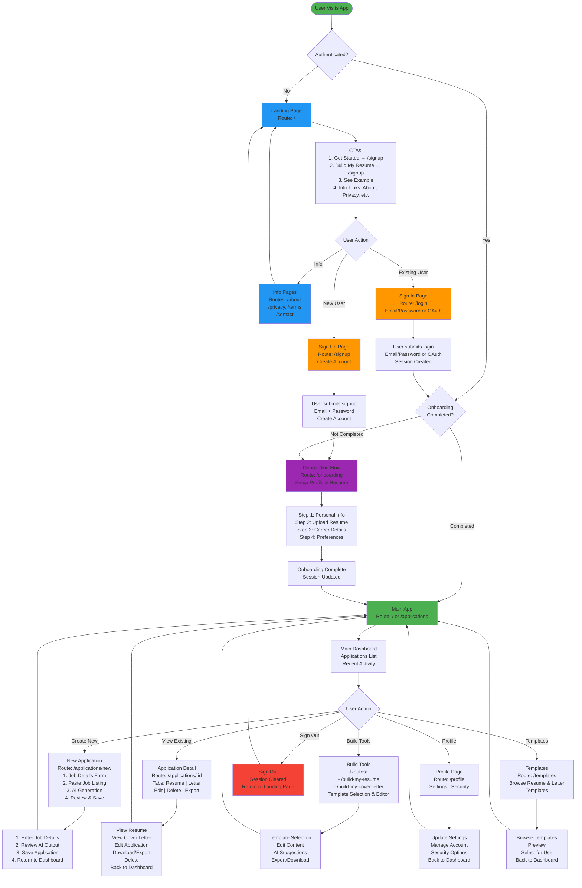
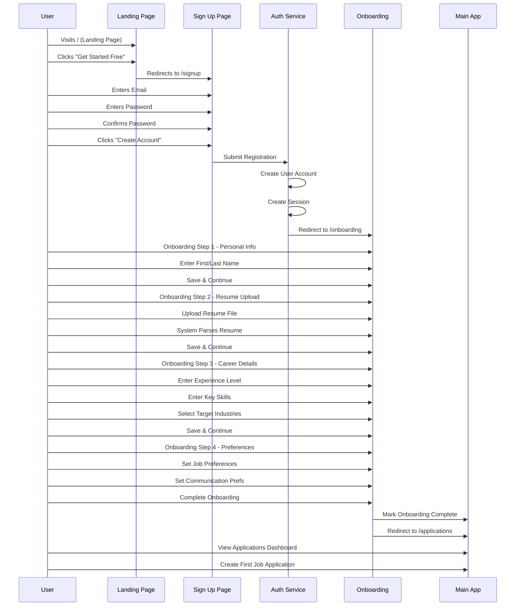
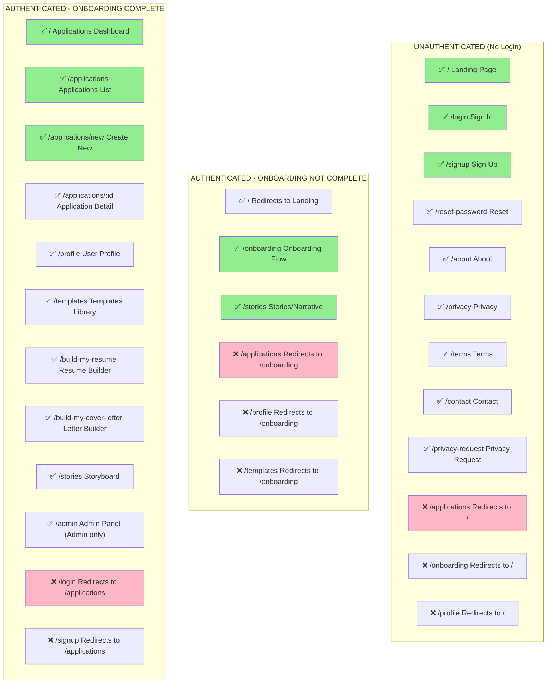
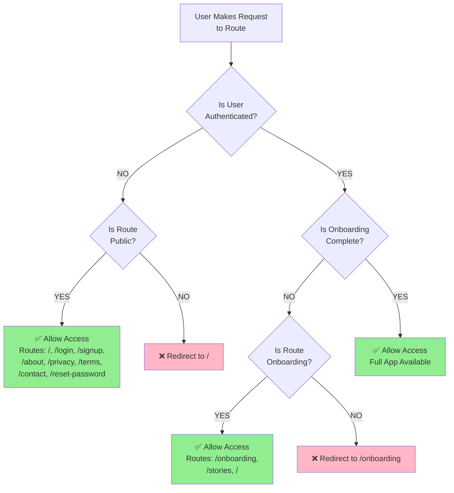
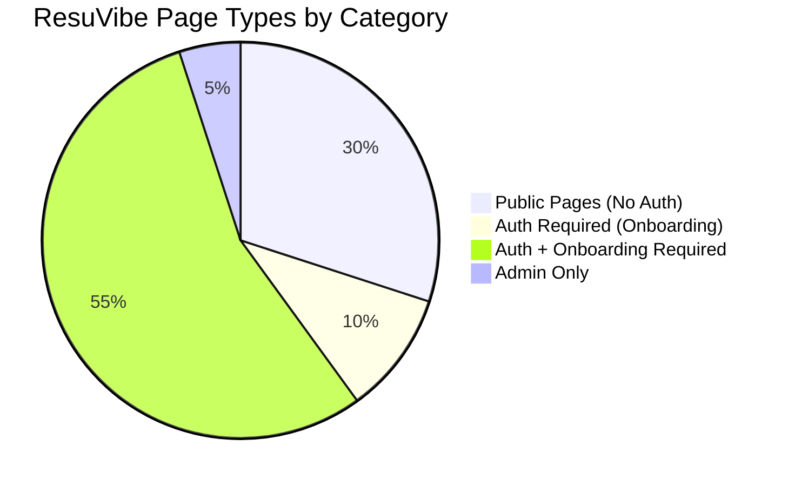
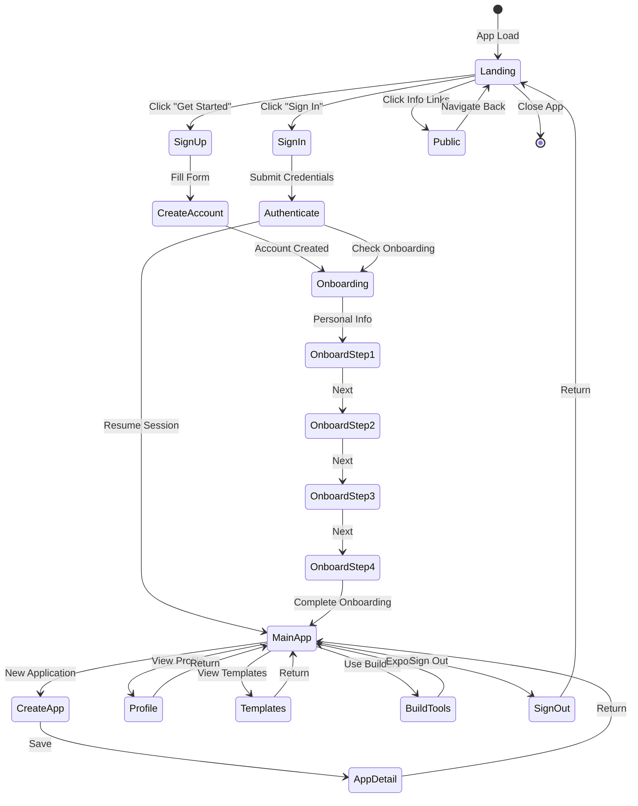

# ResuVibe User Flow Diagram

## Complete User Journey Flow

---

## Authentication State Flow

```mermaid
graph LR
    A["User Visits App"] --> B{Has Valid<br/>Session?}
    
    B -->|NO| C["Unauthenticated State"]
    B -->|YES| D["Authenticated State"]
    
    C --> C1["Routes Available:<br/>/ Landing Page<br/>/login Sign In<br/>/signup Sign Up<br/>/about About<br/>/privacy Privacy<br/>/terms Terms<br/>/contact Contact<br/>/reset-password Reset"]
    
    C1 --> C2{User Action}
    C2 -->|Sign Up| C3["Create Account<br/>→ Onboarding"]
    C2 -->|Sign In| C4["Authenticate<br/>→ Check Onboarding"]
    
    D --> D1{Onboarding<br/>Completed?}
    
    D1 -->|NO| D2["Onboarding State<br/>Routes:<br/>/ → Landing<br/>/onboarding → Onboarding<br/>/stories → Stories<br/>/* → Redirect /onboarding"]
    
    D1 -->|YES| D3["Full App State<br/>Routes:<br/>/ → Applications Dashboard<br/>/applications → App List<br/>/applications/new → Create<br/>/profile → Profile<br/>/templates → Templates<br/>/build-my-resume<br/>/build-my-cover-letter<br/>/admin → Admin Panel"]
    
    D2 --> D2_ACTION["Complete Onboarding"] --> D3
    
    D3 --> D4["User Can Perform<br/>All App Actions"]
    
    C3 --> D
    C4 --> D
    
    style A fill:#4CAF50
    style C fill:#FF9800
    style D fill:#2196F3
    style D3 fill:#4CAF50
```

---

## Detailed New User Signup Flow

---

## Route Access Matrix

---

## Conditional Routing Logic Tree

---

## Page Type Distribution

---

## State Machine Diagram

